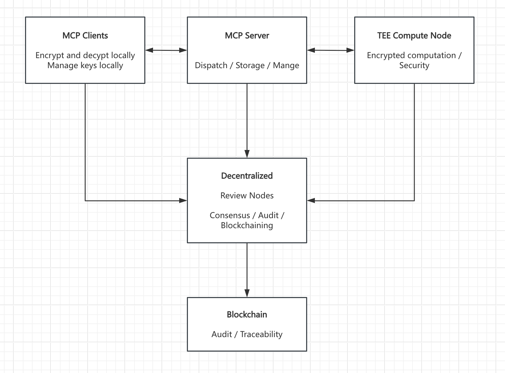

# DeepPowers

  

  <em>DEEPPOWERS is a Fully Homomorphic Encryption (FHE) collaboration framework built for MCP (Model Context Protocol), aiming to provide end-to-end privacy protection and highly efficient computation for the upstream and downstream ecosystems of the MCP protocol. By deeply integrating the FHE framework with the MCP protocol, we are dedicated to creating a secure, efficient, and scalable computing framework for MCP. This ensures that data remains encrypted throughout transmission, storage, and computation, while also supporting complex computing logic, eliminating unnecessary data transmission and computation, and thereby rapidly improving MCP's operational efficiency.</em>

<em align="center">
By removing delays in MCP interactions, it aims to provide robust momentum for the Model Context Protocol (MCP) ecosystem. DEEPPOWERS unleashes a higher level of efficiency, collaboration, and performance for MCP workflows. Support for various MCP servers and leading large language models (LLMs) such as DeepSeek, GPT, Gemini, and Claude ensures unparalleled versatility and enhanced collaborative efficiency. 
</em>

## Overview

Fully Homomorphic Encryption (FHE) allows computations (such as addition, multiplication, etc.) to be performed directly on encrypted data without decryption. The computation results remain encrypted, and only authorized users can decrypt them. FHE resolves the conflict between data privacy and computational efficiency and is suitable for scenarios such as cloud computing, medical data analysis, and financial transactions. Its core lies in ensuring data remains encrypted throughout the process, eliminating the risk of privacy leakage in intermediate steps, while supporting complex computations, providing the ultimate guarantee for data security and compliance. It supports languages such as C++, Python, and CUDA, facilitating integration into the existing MCP ecosystem.

## Key features

- **End-to-end Encryption**: Complete protection for user-LLM interactions with data remaining encrypted throughout the entire process
- **Secure Task Execution**: Encrypted data transmission and computation for sensitive operations without exposure to third parties
- **Seamless MCP Integration**: Deep integration with the Model Context Protocol ecosystem, enhancing MCP's capabilities with privacy-preserving computations
- **Accelerated MCP Workflows**: Process encrypted data locally and reduce unnecessary transfers, significantly improving MCP operational efficiency
- **Enhanced Tool Security**: Enable secure execution of MCP tools that handle sensitive data, expanding the scope of privacy-preserving tasks
- **Cross-Model Compatibility**: Work with various MCP servers and LLM providers including DeepSeek, GPT, Gemini, and Claude
- **Reduced Latency**: Minimize delays in MCP interactions by optimizing the encryption, computation, and decryption processes
- **Privacy-Preserving AI**: Complete AI assistance workflows while maintaining strict data privacy throughout
- **Scalable Architecture**: Designed to grow with the MCP ecosystem, supporting emerging models and computational tools

## Powered by Concrete-ML

DeepPowers is built on [Concrete-ML](https://github.com/zama-ai/concrete-ml), an open-source library developed by Zama for privacy-preserving machine learning using Fully Homomorphic Encryption.

Concrete-ML provides:
- Privacy-preserving ML framework using FHE
- Compatibility with traditional ML frameworks (scikit-learn, PyTorch)
- Tools for quantizing and converting ML models for FHE execution
- Simple and intuitive APIs similar to scikit-learn

With Concrete-ML as its foundation, DeepPowers extends these capabilities to LLM interactions, creating a secure environment for AI-assisted tasks.

## Structure

### 1. MCP Client
- **Responsibilities:**  
  - Local FHE encryption/decryption  
  - Key pair generation and management (private key never leaves the client)  
  - Task submission and encrypted result display  
  - User authentication and permission control

### 2. MCP Server
- **Responsibilities:**  
  - Secure storage and dispatching of encrypted data and tasks  
  - Task management and scheduling  
  - Node status monitoring and logging  
  - No access to plaintext data

### 3. TEE Compute Node
- **Responsibilities:**  
  - Executes encrypted computations using FHE libraries within a Trusted Execution Environment (TEE)  
  - Ensures data and computation security during runtime  
  - Outputs encrypted results and computation proofs

### 4. Decentralised Review Nodes
- **Responsibilities:**  
  - Perform consensus and verification of computation results and proofs  
  - Ensure consistency and integrity of results  
  - Write audit logs and consensus records to the blockchain for traceability

### 5. Blockchain
- **Responsibilities:**  
  - Store audit logs, computation proofs, and operation records  
  - Ensure full traceability and immutability of the process  
  - Facilitate compliance with regulations (e.g., GDPR, HIPAA)

To experience the complete workflow, check out our [Demo](https://github.com/deeppowers/Deeppowers-Demo).

## Key Technology Integration

### FHE Encryption and Ciphertext Computation
- **Encryption Algorithm Selection**: Utilizes industry-leading FHE libraries (such as Microsoft SEAL, OpenFHE, IBM HELib), supporting encryption and computation for various data types including integers and floating-point numbers.
- **Ciphertext Computation Process**: All AI inference, data analysis, and statistical tasks are completed in the encrypted state, with results remaining encrypted.
- **Key Management**: Users generate and maintain FHE key pairs locally, ensuring private keys never leave the local environment to maximize protection against key leakage.

### Trusted Execution Environment (TEE)
- **TEE Function**: Provides trusted execution guarantees for performance bottleneck processes (such as ciphertext batch processing, key exchange), preventing malicious access to runtime memory and registers.
- **FHE and TEE Integration**: Loading FHE libraries within TEE further enhances the security and trustworthiness of ciphertext computation.

### Decentralized Verification and Blockchain Consensus
- **Multi-Node Consensus**: Through blockchain or distributed ledger technology, multiple verification nodes perform consistency checks and reach consensus on ciphertext computation results, ensuring they cannot be tampered with.
- **Transparency and Traceability**: Every operation is traceable, enhancing process transparency and user trust.

### Performance Optimization and Engineering Implementation
- **Batch Processing and Pipeline Optimization**: Optimizing ciphertext batch operations and pipeline processing to reduce FHE computation latency.
- **Algorithm Adaptation and Simplification**: Adapting AI models and statistical algorithms for FHE characteristics, reducing multiplication depth and optimizing operation gate counts.
- **Frontend Integration**: Integrating FHE encryption/decryption functions into terminal applications through WebAssembly or Native SDK to enhance user experience.

## Development

As part of our development effort, we are implementing significant hardware optimizations for Concrete-ML to accelerate encrypted computation processes. These optimizations are crucial for improving the performance of homomorphic encryption operations, which are typically computation-intensive.

Our hardware optimization initiatives include:
- Custom hardware acceleration for key FHE operations
- Parallel processing implementations for encrypted data
- Low-level optimizations for cryptographic primitives
- Specialized memory management for FHE workflows

These optimizations will enable DeepPowers to process encrypted data more efficiently, making privacy-preserving AI interactions faster and more practical for real-world applications.

## Technical Challenges and Solutions

### 1. High Performance Overhead of FHE Computation
- **Challenge**: FHE operations are fundamentally several orders of magnitude slower than plaintext computation, especially with large-scale data or complex models, resulting in high latency and resource consumption.
- **Solutions**:
  - Utilize the latest FHE libraries with SIMD and other batch processing technologies to improve throughput.
  - Prioritize supporting low-depth, low-complexity AI/data analysis tasks for practical application scenarios.
  - Combine with TEE, using secure hardware acceleration for non-core computations to balance security and performance.

### 2. Key Management and User Experience
- **Challenge**: FHE keys, once lost, make data recovery impossible, making local key management and backup critical.
- **Solutions**:
  - Provide multiple key management methods including local secure storage, hardware security modules (HSM), or mnemonic phrases.
  - Design user-friendly key recovery mechanisms to lower operational barriers.

### 3. Algorithm Compatibility and Model Adaptation
- **Challenge**: FHE currently has limited support for certain non-linear operations (such as ReLU, Sigmoid), making complex AI models difficult to migrate directly.
- **Solutions**:
  - Prioritize FHE-friendly algorithms such as linear models, decision trees, and logistic regression.
  - Research homomorphic approximation methods, replacing complex operations with polynomial approximations.
  - Continuously track advances in the FHE field to dynamically upgrade platform capabilities.

### 4. Efficiency and Security of Decentralized Verification
- **Challenge**: Multi-node consensus introduces latency and network load, with the risk of malicious nodes persisting.
- **Solutions**:
  - Adopt efficient Byzantine Fault Tolerance (BFT) consensus algorithms to improve verification efficiency.
  - Introduce reputation mechanisms and economic penalties to incentivize honest participation.

### 5. End-to-End Security and Compliance
- **Challenge**: Proving the platform does not leak user data throughout the process while meeting strict regulations like GDPR and HIPAA.
- **Solutions**:
  - Provide complete security audit logs and zero-knowledge proofs to demonstrate no plaintext data transfer on the platform.
  - Regularly undergo third-party security audits and penetration testing.

## Technical Achievements

1. **End-to-End Encrypted Data Collaborative Computation**  
   User data remains encrypted throughout collection, upload, computation, verification, and return, preventing the platform or third parties from seeing plaintext.

2. **Integration of FHE with TEE, Blockchain, and Other Cutting-Edge Technologies**  
   Breaking single technology barriers to achieve an innovative architecture with multiple security guarantees.

3. **Enabling Compliant AI/Data Analysis Deployment in Highly Sensitive Industries**  
   Allowing medical, financial, and other sectors to fully extract data value without compromising privacy.

4. **Providing a Replicable Technical Paradigm for Distributed Computing and Privacy Protection**  
   Establishing a modular, scalable system architecture for future technology upgrades and business expansion.

## Application Scenarios

- **Medical Joint Modeling**: Multiple hospitals can jointly train AI models to improve diagnostic accuracy without sharing original patient cases, protecting patient privacy.

- **Financial Risk Control Collaboration**: Banks and insurance companies can jointly analyze fraud risks with fully encrypted customer information, preventing sensitive data leakage.

- **Cross-Department Government Data Analysis**: Tax, public security, social security, and other departments can jointly analyze population movement and economic trends without concerns about data misuse.

- **Cloud AI Inference Services**: Users can upload encrypted sensitive data, with cloud AI models inferring directly on ciphertext, preventing cloud service providers from accessing inputs or results.

- **Privacy-Protecting Data Market**: Individuals or enterprises can securely circulate and monetize encrypted data with dual guarantees of data ownership and privacy.

## Roadmap

The DeepPowers SDK development roadmap includes:

### Phase 1: Core Infrastructure
- [x] FHE integration with MCP framework
- [x] Basic encryption protocols for LLM communication
- [x] Prototype SDK for developer testing
- [x] Initial hardware acceleration implementations

### Phase 2: Feature Expansion
- [ ] Enhanced model support for various LLM architectures
- [ ] Expanded API capabilities for diverse applications
- [ ] Performance optimizations for real-time interactions
- [ ] Advanced hardware optimizations for Concrete-ML
- [ ] GPU/FPGA acceleration for critical FHE operations

### Phase 3: Enterprise Integration
- [ ] Advanced security features for organizational deployment
- [ ] Compliance and audit capabilities
- [ ] Scalable infrastructure for high-volume applications
- [ ] Fully optimized hardware acceleration with specialized processing units
- [ ] Enterprise-grade performance for encrypted computations

## Coming Soon

The DeepPowers SDK is currently under active development. Our team is working diligently to bring this technology to developers and organizations who prioritize privacy in their AI implementations.

We plan to introduce a native token-based incentive mechanism for the DeepPowers system, rewarding ecosystem participants such as compute nodes, verification nodes, and data contributors based on task completion and service quality, while implementing staking and penalty mechanisms to ensure network security and trustworthiness. The token will not only serve as an incentive but also empower platform governance, service payments, and ecosystem collaboration, fostering community engagement and sustainable growth. Moving forward, this token incentive system will be a key driver for the prosperity of the DeepPowers ecosystem and the practical adoption of privacy-preserving computation.

Stay tuned for updates on our progress and early access opportunities.

For inquiries about DeepPowers, please contact our development team.

FHEDEEP CA：6uHQEuSFwrCYKByHfkVgWrGWTESRZpNm951PaqxWpump
