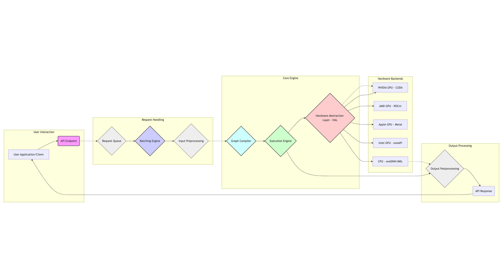

# Deeppowers

<div align="center">
  <a href="deeppowers.xyz">
    
  </a>
</div>
<p align="center">
  <em>DEEPPOWERS is a cutting-edge MCP (Model Context Protocol) inference acceleration engine that is revolutionizing MCP workflows, eliminating latency, optimizing interactions, and powering the next generation of MCP collaboration.</em>
</p>
<p>
<em align="center">
By removing delays in MCP interactions, it aims to provide robust momentum for the Model Context Protocol (MCP) ecosystem. DEEPPOWERS unleashes a higher level of efficiency, collaboration, and performance for MCP workflows. Support for various MCP servers and leading large language models (LLMs) such as DeepSeek, GPT, Gemini, and Claude ensures unparalleled versatility and enhanced collaborative efficiency. 
</em>
</p>


[](LICENSE)
[](docs/userguide.md)
[](https://www.python.org/)
[](https://en.cppreference.com/w/cpp/17)

## Overview

In the rapidly evolving landscape of artificial intelligence, the Model Context Protocol (MCP) stands as a cornerstone for seamless communication and collaboration between AI models. However, the inherent complexities of MCP, often plagued by latency and inefficient workflows, have become a significant bottleneck, hindering the true potential of collaborative AI. Enter 

DEEPPOWERS, a revolutionary inference acceleration engine poised to redefine the very fabric of the MCP ecosystem. More than just an incremental improvement, DEEPPOWERS represents a paradigm shift, ushering in an era of unprecedented speed, efficiency, and collaborative power for the entire MCP world. This is not simply about making things faster; it's about unlocking entirely new possibilities for AI development and deployment.

## Key Features

### Core Architecture
- Hardware Abstraction Layer (HAL)
- CUDA device management
- Basic tensor operations
- Kernel management system

### Request Processing
- Request queue management
- Batch processing system
- Priority scheduling
- Error handling mechanism

### Quantization
- INT8 quantization support
- INT4 quantization support
- Mixed-precision quantization
- Calibration data management

### API Interface
- C++ API infrastructure
- Python bindings
- REST API infrastructure
- gRPC service infrastructure

### Middleware
- Authentication middleware
- Rate limiting middleware
- Logging middleware
- Monitoring middleware
- Error handling middleware

### Inference Optimization
- Model operator fusion
- Weight pruning techniques
- KV-cache optimization
- Automatic optimization selection
- Performance profiling and benchmarking

## Architecture

### Technical Architecture Diagram



The architecture follows a pipeline-based design with several key components:

1. **Request Flow**
   - User requests enter the system through a unified interface
   - Requests are queued and prioritized in the Request Queue
   - Batching system groups compatible requests for optimal processing
   - Execution Engine processes batches and generates results
   - Output is post-processed and returned to users

2. **Control Flow**
   - Configuration Manager oversees system settings and runtime parameters
   - Graph Compiler optimizes computation graphs for execution
   - Hardware Abstraction Layer provides unified access to different hardware backends

3. **Optimization Points**
   - Dynamic batching for throughput optimization
   - Graph compilation for computation optimization
   - Hardware-specific optimizations through HAL
   - Configuration-based performance tuning

### Directory Structure

```
deeppowers/
├── src/
│   ├── core/                      # Core implementation
│   │   ├── hal/                  # Hardware Abstraction Layer for device management
│   │   ├── request_queue/        # Request queue and management system
│   │   ├── batching/            # Batch processing and optimization
│   │   ├── execution/           # Execution engine and runtime
│   │   ├── distributed/         # Distributed computing support
│   │   ├── scheduling/          # Task scheduling and resource management
│   │   ├── monitoring/          # System monitoring and metrics
│   │   ├── config/             # Configuration management
│   │   ├── preprocessing/      # Input preprocessing pipeline
│   │   ├── postprocessing/     # Output postprocessing pipeline
│   │   ├── graph/              # Computation graph management
│   │   ├── api/               # Internal API implementations
│   │   ├── model/             # Base model architecture
│   │   ├── memory/            # Memory management system
│   │   ├── inference/         # Inference engine core
│   │   ├── models/            # Specific model implementations
│   │   ├── tokenizer/         # Tokenization implementations
│   │   └── utils/             # Utility components
│   ├── api/                   # External API implementations
│   └── common/                # Common utilities
├── tests/                     # Test suite
├── scripts/                   # Utility scripts
├── examples/                  # Example usage  
├── docs/                      # Documentation
└── README.md                  # Project overview
```

The core module is organized into specialized components:

### Infrastructure Components
- **HAL (Hardware Abstraction Layer)**: Manages hardware devices and provides unified interface for different backends
- **Request Queue**: Handles incoming requests with priority management and load balancing
- **Batching**: Implements dynamic batching strategies for optimal throughput
- **Execution**: Core execution engine for model inference
- **Distributed**: Supports distributed computing and model parallelism

### Resource Management
- **Scheduling**: Manages task scheduling and resource allocation
- **Monitoring**: System metrics collection and performance monitoring
- **Config**: Configuration management and validation
- **Memory**: Advanced memory management and optimization

### Processing Pipeline
- **Preprocessing**: Input data preparation and normalization
- **Postprocessing**: Output processing and formatting
- **Graph**: Computation graph optimization and management
- **Inference**: Core inference engine implementation

### Model Components
- **Model**: Base model architecture and interfaces
- **Models**: Specific model implementations (GPT, BERT, etc.)
- **Tokenizer**: Text tokenization algorithms and utilities

### Support Systems
- **API**: Internal API implementations for core functionality
- **Utils**: Common utilities and helper functions

## Installation

### Prerequisites
- C++17 compiler
- CMake 3.15+
- Python 3.8+ (for Python bindings)
- ICU library for Unicode support

```bash
# Install dependencies (Ubuntu)
sudo apt-get install build-essential cmake libicu-dev

# Clone and build
git clone https://github.com/deeppowers/deeppowers.git
cd deeppowers
mkdir build && cd build
cmake -DCMAKE_BUILD_TYPE=Release ..
make -j

# Install Python package (optional)
cd ./src/api/python
pip install -e .
```

```bash
# Clone the repository
git clone https://github.com/deeppowers/deeppowers.git
cd deeppowers

# Install dependencies
pip install -r requirements.txt

# Build from source
mkdir build && cd build
cmake ..
make -j$(nproc)
```

## Quick Start

### Basic Usage
```python
import deeppowers as dp

# Method 1: Using Pipeline (Recommended)
# Initialize pipeline with pre-trained model
pipeline = dp.Pipeline.from_pretrained("deepseek-v3")

# Generate text
response = pipeline.generate(
    "Hello, how are you?",
    max_length=50,
    temperature=0.7,
    top_p=0.9
)
print(response)

# Batch processing
responses = pipeline.generate(
    ["Hello!", "How are you?"],
    max_length=50,
    temperature=0.7
)

# Save and load pipeline
pipeline.save("my_pipeline")
loaded_pipeline = dp.Pipeline.load("my_pipeline")

# Method 2: Using Tokenizer and Model separately
# Initialize tokenizer
tokenizer = dp.Tokenizer(model_name="deepseek-v3")  # or use custom vocab
tokenizer.load("path/to/tokenizer.model")

# Initialize model
model = dp.Model.from_pretrained("deepseek-v3")

# Create pipeline manually
pipeline = dp.Pipeline(model=model, tokenizer=tokenizer)
```

### Advanced Usage

#### Custom Tokenizer Training
```python
# Initialize tokenizer with specific type
tokenizer = dp.Tokenizer(tokenizer_type=dp.TokenizerType.WORDPIECE)

# Train on custom data
texts = ["your", "training", "texts"]
tokenizer.train(texts, vocab_size=30000, min_frequency=2)

# Save and load
tokenizer.save("tokenizer.model")
tokenizer.load("tokenizer.model")

# Basic tokenization
tokens = tokenizer.encode("Hello, world!")
text = tokenizer.decode(tokens)

# Batch processing with parallel execution
texts = ["multiple", "texts", "for", "processing"]
tokens_batch = tokenizer.encode_batch(
    texts,
    add_special_tokens=True,
    padding=True,
    max_length=128
)
```

#### Advanced Generation Control
```python
# Configure generation parameters
response = pipeline.generate(
    "Write a story about",
    max_length=200,          # Maximum length of generated text
    min_length=50,           # Minimum length of generated text
    temperature=0.7,         # Controls randomness (higher = more random)
    top_k=50,               # Limits vocabulary to top k tokens
    top_p=0.9,              # Nucleus sampling threshold
    num_return_sequences=3,  # Number of different sequences to generate
    repetition_penalty=1.2   # Penalize repeated tokens
)

# Batch generation with multiple prompts
prompts = [
    "Write a story about",
    "Explain quantum physics",
    "Give me a recipe for"
]
responses = pipeline.generate(
    prompts,
    max_length=100,
    temperature=0.8
)
```

#### Model Optimization
```python
# Load model
model = dp.load_model("deepseek-v3", device="cuda", dtype="float16")

# Apply automatic optimization
results = dp.optimize_model(model, optimization_type="auto", level="o2", enable_profiling=True)
print(f"Achieved speedup: {results['speedup']}x")
print(f"Memory reduction: {results['memory_reduction']}%")

# Apply specific optimization techniques
results = dp.optimize_model(model, optimization_type="fusion")
results = dp.optimize_model(model, optimization_type="pruning")
results = dp.optimize_model(model, optimization_type="caching")

# Quantize model to INT8 precision
results = dp.quantize_model(model, precision="int8")
print(f"INT8 quantization speedup: {results['speedup']}x")
print(f"Accuracy loss: {results['accuracy_loss']}%")

# Run benchmarks
benchmark_results = dp.benchmark_model(
    model, 
    input_text="This is a test input for benchmarking.",
    num_runs=10, 
    warmup_runs=3
)
print(f"Average latency: {benchmark_results['avg_latency_ms']} ms")
print(f"Throughput: {benchmark_results['throughput_tokens_per_sec']} tokens/sec")
```

## Performance Tuning

### Memory Optimization
```python
# Configure memory pool
tokenizer.set_memory_pool_size(4096)  # 4KB blocks
tokenizer.enable_string_pooling(True)

# Monitor memory usage
stats = tokenizer.get_memory_stats()
print(f"Memory pool usage: {stats['pool_usage']}MB")
print(f"String pool size: {stats['string_pool_size']}")
```

### Parallel Processing
```python
# Configure thread pool
tokenizer.set_num_threads(8)
tokenizer.set_batch_size(64)

# Process large datasets
with open("large_file.txt", "r") as f:
    texts = f.readlines()
tokens = tokenizer.encode_batch_parallel(texts)
```

## Documentation

- [User Guide](docs/userguide.md)
- [Architecture](docs/architecture.md)
- [Design Principles](docs/principles.md)

## Performance Optimization

DeepPowers includes several performance optimization features:
- Memory pooling and caching
- Dynamic batching
- Parallel processing
- Mixed-precision computation
- Distributed inference
- Model quantization (INT8, INT4, mixed precision)
- Operator fusion
- KV-cache optimization

## Roadmap

### Implemented Features ✨
- ✅ Hardware Abstraction Layer (HAL) - Basic CUDA and ROCM support
- ✅ Tokenizer Implementation - WordPiece and BPE algorithms
- ✅ Memory Management - Basic memory pooling system
- ✅ Request Queue Management - Basic request handling
- ✅ Configuration System - Basic config management
- ✅ Python Bindings - Basic API interface
- ✅ Monitoring System - Basic metrics collection
- ✅ Model Execution Framework - Core implementation
- ✅ Inference Pipeline - Basic pipeline structure
- ✅ Dynamic Batch Processing - Initial implementation
- ✅ Model Loading System - Support for ONNX, PyTorch, and TensorFlow formats
- ✅ Inference Engine - Complete implementation with text generation capabilities
- ✅ Inference Optimization - Operator fusion, weight pruning, and caching optimizations
- ✅ Quantization System - INT8, INT4, and mixed precision support
- ✅ Benchmarking Tools - Performance measurement and optimization metrics
- ✅ Streaming Generation - Real-time text generation with callback support
- ✅ Advanced Batching Strategies - Batch processing with parallel inference

### In Progress 🚧
- 🔄 Computation Graph System - Advanced graph optimizations
- 🔄 Distributed Computing Support - Multi-node inference
- 🔄 Auto-tuning System - Automatic performance optimization
- 🔄 Dynamic Shape Support - Flexible tensor dimensions handling

### Planned Features 🎯
- 📋 Advanced Model Support
  - Advanced LLM implementations (GPT, Gemini, Claude)
  - More sophisticated model architecture support
  - Model compression and distillation
- 📋 Performance Optimization
  - Advanced memory management
  - Kernel fusion optimizations
  - Custom CUDA kernels for critical operations
- 📋 Advanced Features
  - Multi-GPU parallelism
  - Distributed inference across nodes
  - Advanced caching system with prefetching
  - Speculative decoding
  - Custom operator implementation

## Benchmarking Tools

The project includes comprehensive benchmarking tools:

```bash
# Run performance benchmark
python examples/optimize_and_benchmark.py --model your-model --benchmark

# Run with optimization
python examples/optimize_and_benchmark.py --model your-model --optimization auto --level o2 --benchmark

# Apply quantization
python examples/optimize_and_benchmark.py --model your-model --quantize --quantize-precision int8 --benchmark

# Generate text with optimized model
python examples/optimize_and_benchmark.py --model your-model --optimization auto --generate --prompt "Your prompt here"
```

## Contributing

We welcome contributions! Please see our [Contributing Guidelines](CONTRIBUTING.md) for details.

## License

This project is licensed under the Apache License 2.0 - see the [LICENSE](LICENSE) file for details.

## Acknowledgments

Special thanks to all contributors and the open-source community.

## Contact

- GitHub Issues: [Create an issue](https://github.com/deeppowers/deeppowers/issues)
